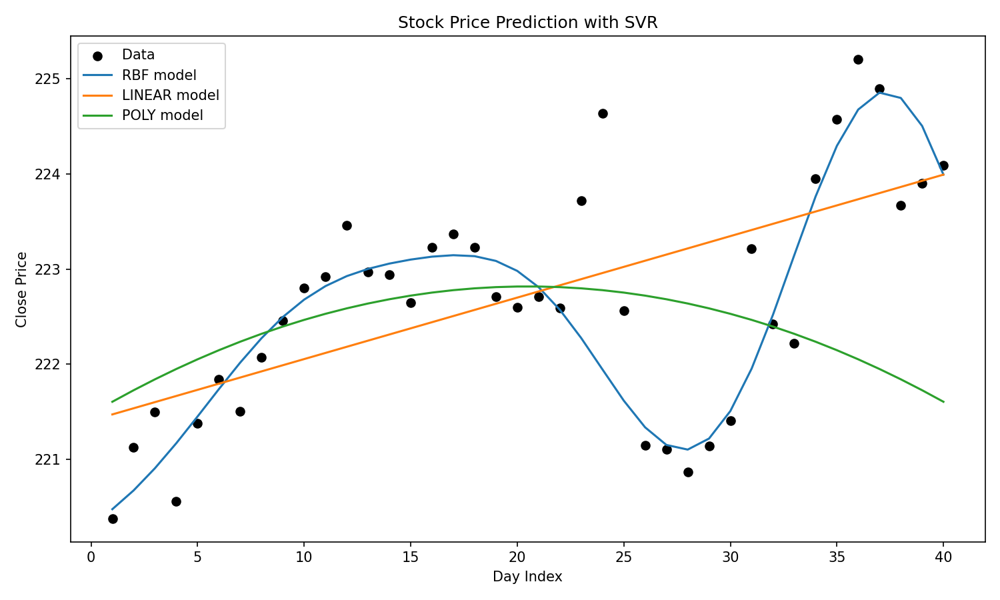

# Stock Price Prediction with SVR

This project demonstrates how to use **Support Vector Regression (SVR)** to predict stock prices from a CSV file.

## Features
- Loads historical stock price data from CSV (Date, Close).
- Trains three SVR models: **RBF**, **Linear**, and **Polynomial**.
- Visualizes the fitted models against actual prices.
- Predicts the stock price for a given future day index.

## Project Structure
```
stock_price_prediction_svr/
├─ README.md
├─ requirements.txt
├─aapl_sample.csv
└─ app.py
```

## 1) Setup
```bash
python3 -m venv .venv
source .venv/bin/activate   # (Linux/Mac)
# .venv\Scripts\activate  # (Windows)
pip install -r requirements.txt
```

## 2) Prepare the CSV
CSV format must be:
```
Date,Close
2025-07-01,220.15
2025-07-02,221.34
...
```

An example dataset is included: `data/aapl_sample.csv`.

## 3) Run the script
```bash
python src/app.py --stock_csv data/aapl_sample.csv --predict_day 45
```

## 4) Outputs
- `svr_models.png` → plot of data + model fits  
- `predictions.json` → numeric predictions from RBF, Linear, and Poly SVR  

### Example Plot:


